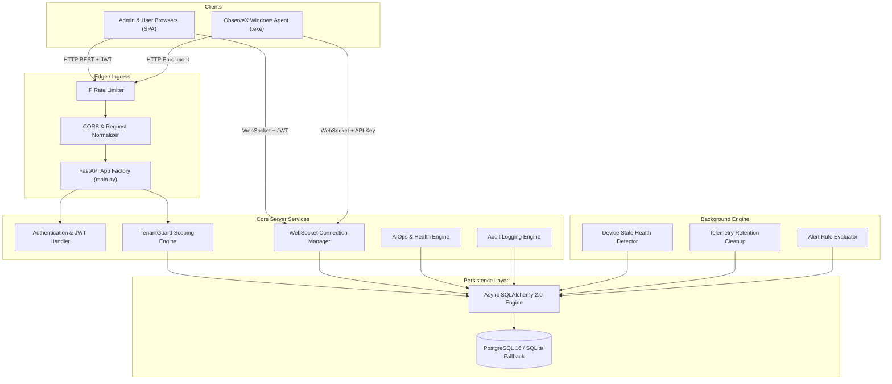
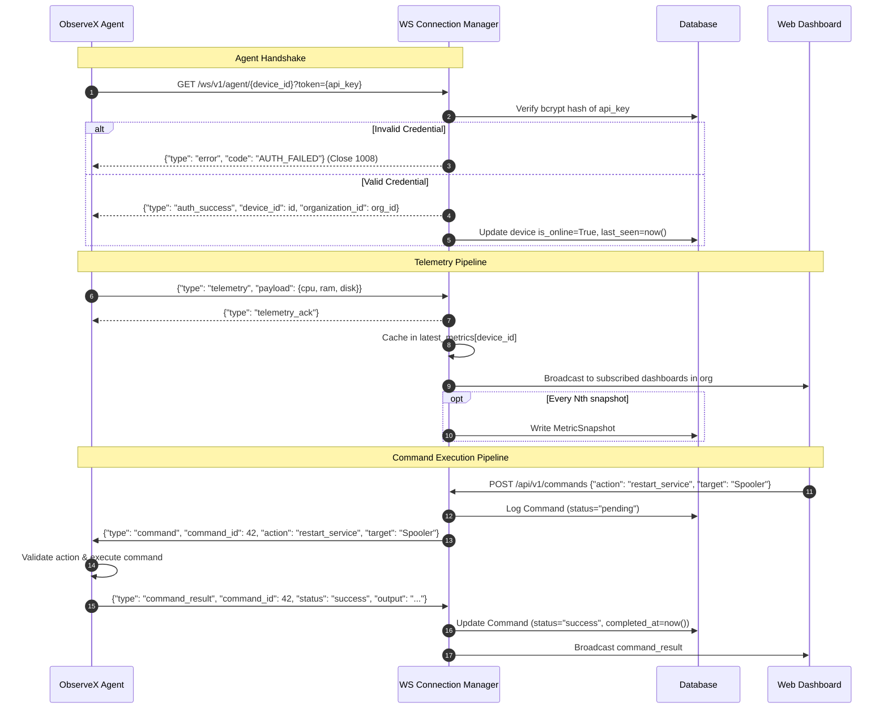
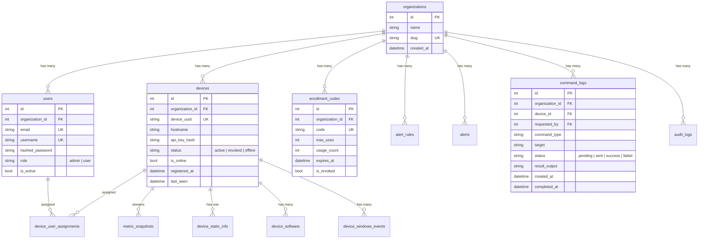

# ObserveX Architecture & Technical Specification

This document provides the detailed technical design, component interactions, security model, and data schemas for ObserveX v2.0.0.

---

## 1. System Topology

---

## 2. Multi-Tenancy & Security Model

### Tenant Isolation Guarantee

ObserveX operates on a **shared-database, isolated-schema/tenant** pattern:

1. **Root Entity**: Every organization is represented by the `Organization` model.
2. **Tenant Foreign Key**: All core business entities (`users`, `devices`, `enrollment_codes`, `alerts`, `alert_rules`, `command_logs`, `audit_logs`, `metric_snapshots`) contain a non-nullable `organization_id` column.
3. **TenantGuard Helper**:
   `TenantGuard.get_or_404(Model, id, current_user, db)` guarantees that any attempt by a user from Tenant A to access an ID belonging to Tenant B raises `HTTPException(404, "Not found")`.
   - **Why 404 instead of 403?** Returning 403 leaks the existence of IDs across tenant boundaries (enabling sequential ID enumeration). Returning 404 provides zero-knowledge isolation.
4. **Device RBAC**:
   - **Administrators**: Can view, configure, and issue commands to any device belonging to their organization.
   - **Standard Users**: Can only view devices explicitly assigned to them via the `DeviceUserAssignment` relation.

---

## 3. WebSocket Infrastructure

### Connection Management (`server/websockets/manager.py`)

The `ConnectionManager` maintains two distinct connection pools:

---

## 4. Database Entity Relationships

---

## 5. Security & Attack Surface Hardening

| Vector | Mitigation Mechanism |
|---|---|
| **SQL Injection** | Parameterized queries enforced across 100% of routes via SQLAlchemy 2.0 ORM expressions. |
| **Command Injection** | Strict server-side allowlist (`restart_service`, `kill_process`, `cleanup_temp`). Targets are validated against `^[a-zA-Z0-9_.\- ]{1,128}$`. Arbitrary shell scripts are completely disallowed. |
| **Credential Theft** | Device API keys are hashed with bcrypt. Plaintext credentials are never saved on disk or in the database. |
| **Cross-Tenant Enumeration** | All endpoints enforce `TenantGuard.get_or_404()`. Cross-tenant lookup returns 404 rather than 403. |
| **Credential Reuse / Code Theft** | Enrollment codes support `max_uses` (typically single-use) and time-based expiration. Revocation is instantaneous via admin API. |
| **DoS via Telemetry Flooding** | Telemetry ingestion rate is throttled, with lightweight in-memory ring buffers and batched database writes. |
